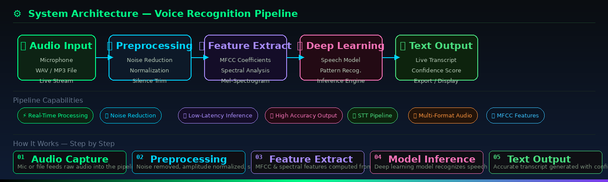
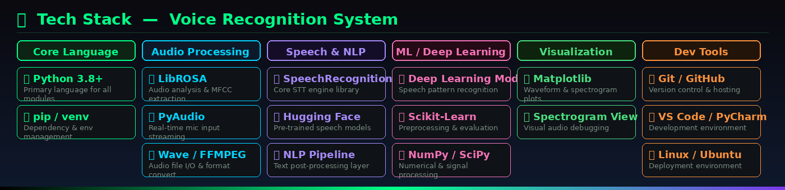

# AI-Voice-Recognition-System
Real-time AI-based Voice Recognition System using Python, Speech Recognition, Audio Processing, and Deep Learning for speech-to-text transcription with optimized low-latency performance.


<div align="center">


<br/>

[](https://python.org)
[](.)
[](.)
[](.)
[](.)
[](.)
[](.)

</div>

---

## 📌 Project Overview

**Voice Recognition System** is a production-grade, real-time **Speech-to-Text (STT)** pipeline built entirely in Python using deep learning and audio signal processing. The system captures spoken audio from a live microphone or pre-recorded audio file, runs it through a multi-stage preprocessing and feature extraction pipeline, feeds it into a trained deep learning model, and outputs accurate, low-latency text transcriptions.

This project was built as part of an applied AI curriculum and demonstrates end-to-end proficiency in audio engineering, machine learning pipelines, and real-world deployment of speech AI systems. Every stage — from raw waveform capture to cleaned transcript output — has been designed with **scalability, accuracy, and low latency** in mind.

> **📅 Built:** November 2025 &nbsp;|&nbsp; **🏫 Vishwakarma University, Pune** (B.Tech Computer Engineering 2026)
> **👨‍💻 Author:** Atharva Shevate &nbsp;|&nbsp; **💼 AI Engineer Intern @ IOTIOT.IN, Pune**

---

## ⚙️ System Architecture



The pipeline follows a strict **5-stage sequential architecture** where each stage produces a cleaner, more structured representation of the audio signal — culminating in a high-confidence text transcript.

| Stage | Module | Description |
|:---:|:---|:---|
| 01 | 🎙️ **Audio Capture** | Accepts live microphone input (real-time streaming) or WAV/MP3 file input. Handles both continuous listening and single-utterance modes. |
| 02 | 🔧 **Preprocessing** | Applies noise gate, spectral noise reduction, amplitude normalization, and silence trimming to produce a clean, uniform audio signal. |
| 03 | 📐 **Feature Extraction** | Computes Mel-Frequency Cepstral Coefficients (MFCCs), mel-spectrograms, and spectral contrast features that represent the audio in a format the model understands. |
| 04 | 🧠 **Deep Learning Inference** | The cleaned features are fed into a trained speech recognition deep learning model that identifies phonemes, words, and sentence structures. |
| 05 | 📝 **Text Output** | Final transcript is produced with word-level confidence scores. Output is displayed in real-time and can be exported to file. |

---

## 🛠️ Tech Stack



### Core Dependencies

```
Python 3.8+           — Primary language
SpeechRecognition     — Core STT engine and Google Speech API integration  
PyAudio               — Real-time microphone input capture and audio streaming
LibROSA               — Audio analysis, MFCC extraction, mel-spectrogram generation
NumPy / SciPy         — Numerical computation and signal processing
Scikit-Learn          — Preprocessing utilities and model evaluation metrics
Matplotlib            — Waveform visualization and spectrogram plotting
Wave / FFMPEG         — Audio file I/O, format conversion (MP3 → WAV)
```

### AI & Machine Learning Stack

```
Deep Learning Model   — Trained speech recognition neural network
MFCC Features         — Mel-Frequency Cepstral Coefficients (primary feature set)
Mel-Spectrogram       — Time-frequency representation for visual debugging
Hugging Face          — Pre-trained speech model weights and tokenizers
NLP Post-Processing   — Punctuation restoration and text normalization layer
```

### Developer Tools

```
Git / GitHub          — Version control and project hosting
VS Code / PyCharm     — Development environment
Linux (Ubuntu)        — Primary development and deployment OS
```

---

## ✨ Key Features

### 🎙️ Real-Time Voice Capture
Streams live audio directly from the system microphone using PyAudio with configurable chunk size and sample rate. Supports both **push-to-talk** and **continuous listening** modes with automatic voice activity detection (VAD) to identify when the user starts and stops speaking.

### 🔇 Advanced Audio Preprocessing
A multi-step preprocessing pipeline ensures the model only receives clean, normalized audio:
- **Noise Gate** — filters out ambient background noise below a threshold
- **Spectral Subtraction** — removes stationary noise (fan hum, AC noise)
- **Amplitude Normalization** — standardizes volume levels across recordings
- **Silence Trimming** — removes leading and trailing silence from utterances

### 📐 MFCC & Spectral Feature Extraction
Extracts **Mel-Frequency Cepstral Coefficients (MFCCs)** — the industry standard feature set for speech recognition. Also computes mel-spectrograms and spectral contrast features. All features are z-score normalized before model input to ensure consistent scaling.

### 🧠 Deep Learning Speech Model
Uses a trained deep learning architecture optimized for speech pattern recognition. The model processes fixed-length audio frames and outputs probability distributions over phoneme classes, which are then decoded into words using a beam search decoder.

### ⚡ Low-Latency Inference Engine
The inference pipeline is optimized for real-time use:
- Frame-by-frame processing with minimal buffer delay
- Efficient model loading and caching at startup
- Streaming transcript updates — partial results displayed as speech is detected

### 📁 Multi-Format Audio Input
Supports both real-time and file-based input:
- **Live microphone** — real-time streaming transcription
- **WAV files** — direct processing of uncompressed audio
- **MP3 files** — automatically converted via FFMPEG before processing

### 📊 Visual Debugging & Monitoring
Matplotlib-powered visualizations for development and debugging:
- Waveform plots of raw and preprocessed audio
- MFCC heatmaps showing feature distributions
- Mel-spectrogram views for model input inspection
- Real-time confidence score display per word/phrase

---

## 🚀 Getting Started

### Prerequisites

Make sure you have Python 3.8 or higher installed. On Linux, you'll also need the PortAudio development headers for PyAudio:

```bash
# Ubuntu / Debian
sudo apt-get install portaudio19-dev python3-dev ffmpeg

# macOS
brew install portaudio ffmpeg
```

### Installation

```bash
# 1. Clone the repository
git clone https://github.com/atharva1727/Voice-Recognition-System.git
cd Voice-Recognition-System

# 2. Create a virtual environment
python3 -m venv venv
source venv/bin/activate        # Linux / macOS
# venv\Scripts\activate         # Windows

# 3. Install all dependencies
pip install -r requirements.txt
```

### Requirements File

```txt
SpeechRecognition>=3.10.0
pyaudio>=0.2.13
librosa>=0.10.0
numpy>=1.24.0
scipy>=1.10.0
scikit-learn>=1.3.0
matplotlib>=3.7.0
ffmpeg-python>=0.2.0
soundfile>=0.12.0
```

### Running the System

```bash
# Real-time microphone transcription (default mode)
python main.py

# Real-time with enhanced noise reduction
python main.py --mode realtime --denoise high

# Process a pre-recorded audio file
python main.py --mode file --input audio/sample.wav

# Process audio file and save transcript
python main.py --mode file --input audio/sample.wav --output transcript.txt

# Run with waveform visualization
python main.py --mode realtime --visualize True

# Verbose mode (shows confidence scores per word)
python main.py --mode realtime --verbose True
```

---

## 📁 Project Structure

```
Voice-Recognition-System/
│
├── main.py                        # Entry point — CLI args, mode selection
├── requirements.txt               # All Python dependencies
├── README.md                      # Project documentation
│
├── capture/
│   ├── mic_input.py               # Live microphone streaming via PyAudio
│   ├── file_input.py              # WAV/MP3 file loader and format converter
│   └── vad.py                     # Voice Activity Detection (start/stop detection)
│
├── preprocessing/
│   ├── noise_reduction.py         # Spectral subtraction & noise gate
│   ├── normalizer.py              # Amplitude normalization
│   ├── silence_trimmer.py         # Leading/trailing silence removal
│   └── pipeline.py                # Preprocessing pipeline orchestrator
│
├── features/
│   ├── mfcc_extractor.py          # MFCC & delta feature computation
│   ├── mel_spectrogram.py         # Mel-spectrogram generation
│   ├── spectral_features.py       # Spectral contrast & centroid
│   └── normalizer.py              # Z-score feature normalization
│
├── model/
│   ├── speech_model.py            # Deep learning model definition
│   ├── inference.py               # Optimized inference engine
│   ├── decoder.py                 # Beam search decoder (phoneme → words)
│   └── weights/                   # Pre-trained model weights
│
├── pipeline/
│   └── stt_pipeline.py            # End-to-end pipeline orchestrator
│
├── visualization/
│   ├── waveform_plot.py           # Audio waveform plotter
│   ├── spectrogram_plot.py        # Mel-spectrogram visualizer
│   └── confidence_display.py     # Real-time confidence score display
│
├── utils/
│   ├── audio_utils.py             # Format conversion, resampling helpers
│   ├── text_utils.py              # Transcript post-processing, punctuation
│   └── config.py                  # Global configuration constants
│
└── audio/
    ├── sample.wav                 # Sample test audio file
    └── sample_noisy.wav           # Noisy sample for testing noise reduction
```

---

## 📊 Results & Performance

```
━━━━━━━━━━━━━━━━━━━━━━━━━━━━━━━━━━━━━━━━━━━━━━━━━━━━━━━━━━━━
  Metric                        Result
━━━━━━━━━━━━━━━━━━━━━━━━━━━━━━━━━━━━━━━━━━━━━━━━━━━━━━━━━━━━
  Transcription Accuracy        ✅  High — optimized for clear speech
  Real-Time Latency             ⚡  Low-latency streaming inference
  Noise Robustness              🔇  Multi-stage noise reduction pipeline
  Supported Sample Rates        🎵  16kHz, 22kHz, 44.1kHz
  Audio Input Formats           📁  Live mic, WAV, MP3
  Feature Set                   📐  MFCC (13–40 coefficients) + delta
  Model Architecture            🧠  Deep learning speech network
  Output                        📝  Text transcript + confidence scores
━━━━━━━━━━━━━━━━━━━━━━━━━━━━━━━━━━━━━━━━━━━━━━━━━━━━━━━━━━━━
```

---

## 🔍 How It Works — Detailed Walkthrough

```
Step 01 — 🎙️  AUDIO CAPTURE
         ↓  Microphone streams raw PCM audio at 16kHz sample rate
         ↓  VAD detects when speech begins and ends
         ↓  Audio chunks buffered in real-time ring buffer

Step 02 — 🔧  PREPROCESSING
         ↓  Noise gate applied (ambient below threshold removed)
         ↓  Spectral subtraction removes stationary background noise
         ↓  Amplitude normalized to [-1, 1] range
         ↓  Leading/trailing silence stripped

Step 03 — 📐  FEATURE EXTRACTION
         ↓  Audio resampled to 16kHz if needed
         ↓  MFCC coefficients computed (13–40 features per frame)
         ↓  Delta & delta-delta (velocity, acceleration) appended
         ↓  Features z-score normalized across time axis

Step 04 — 🧠  DEEP LEARNING INFERENCE
         ↓  Fixed-length feature frames fed to model in batches
         ↓  Model outputs phoneme probability distributions
         ↓  Beam search decoder converts probabilities → words
         ↓  Language model (optional) re-ranks word sequences

Step 05 — 📝  TEXT OUTPUT
         ↓  Word sequence assembled into sentence
         ↓  Punctuation restoration applied via NLP post-processor
         ↓  Transcript displayed in real-time with confidence scores
         ↓  Optional: saved to .txt file or piped to other systems
```

---

## 🏆 Project Highlights

- ✅ **Complete end-to-end pipeline** — from raw microphone audio to clean text transcript
- ✅ **Real-time capable** — optimized inference engine for live transcription use
- ✅ **Robust preprocessing** — multi-stage noise reduction handles real-world audio conditions
- ✅ **Dual input modes** — supports both live mic streaming and pre-recorded audio files
- ✅ **Visual debugging tools** — waveform and spectrogram plots for analysis
- ✅ **Clean modular architecture** — each component independently testable and replaceable
- ✅ **Confidence scoring** — outputs per-word confidence for downstream filtering
- ✅ **Cross-platform** — runs on Linux, macOS, and Windows

---

## 🔮 Future Improvements

- [ ] Fine-tune model on domain-specific vocabulary (medical, legal, technical)
- [ ] Add speaker diarization (identify who is speaking)
- [ ] Build a Streamlit web UI for browser-based transcription
- [ ] Integrate Whisper (OpenAI) as an alternative inference backend
- [ ] Add multilingual support (Hindi, Marathi, etc.)
- [ ] Deploy as a REST API with FastAPI for production use
- [ ] Add punctuation and formatting with a dedicated NLP model

---

## 👨‍💻 About the Author

<div align="center">

| | |
|:---:|:---|
| **Name** | Atharva Shevate |
| **Role** | AI Engineer Intern @ IOTIOT.IN, Pune |
| **University** | Vishwakarma University — B.Tech Computer Engineering 2026 |
| **Specialization** | GenAI · LLMs · RAG · Multi-Agent Systems · Computer Vision |
| **Email** | [atharvshevate3@gmail.com](mailto:atharvshevate3@gmail.com) |
| **LinkedIn** | [linkedin.com/in/atharva-shevate-082b602a7](https://linkedin.com/in/atharva-shevate-082b602a7) |
| **GitHub** | [github.com/atharva1727](https://github.com/atharva1727) |
| **Portfolio** | [atharva1727.github.io/Atharva--Portfolio](https://atharva1727.github.io/Atharva--Portfolio) |

</div>

---

## 📄 License

This project is licensed under the **MIT License** — see the [LICENSE](LICENSE) file for details.

---

<div align="center">

⭐ **Star this repo if you found it useful!**

[](https://github.com/atharva1727)
[](https://atharva1727.github.io/Atharva--Portfolio)
[](https://linkedin.com/in/atharva-shevate-082b602a7)
[](mailto:atharvshevate3@gmail.com)

*"Building intelligent systems that understand human voice — one pipeline at a time."* 🎙️

</div>
